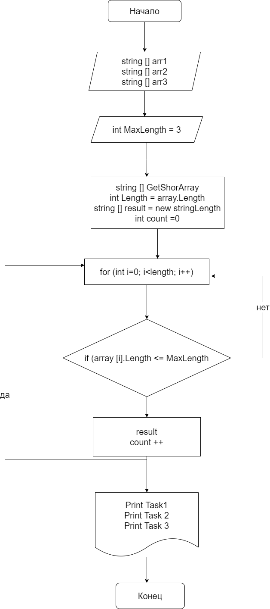

**Итоговая проверочная работа**

*Необходимо решить задачу*

**-Задача**
Написать программу, которая из имеющегося массива строк формирует массив из строк, длина которых меньше либо равна 3 символа. Первоначальный массив можно ввести с клавиатуры, либо задать на старте выполнения алгоритма. При решение не рекомендуется пользоваться коллекциями, лучше обойтись исключительно массивами

Для решения данной задачи:
1. было объявлено три массива (примеры были приведены к описанию проверочной работы)
2. был объявлен размер
3. прописываем цикл и условие цикла, при которм цикл либо замыкается либо продолжает проверку дальше
4. прописываем вывод при условие если условие не выполняется (элементы массива больше 3)
5. прописываем условия выводя, если условия задачи выполняются

Так же необходимо было создать репозиторий на GitHub, составить блок-схему к задачи и написать описания ее решения в файле Readme.md

